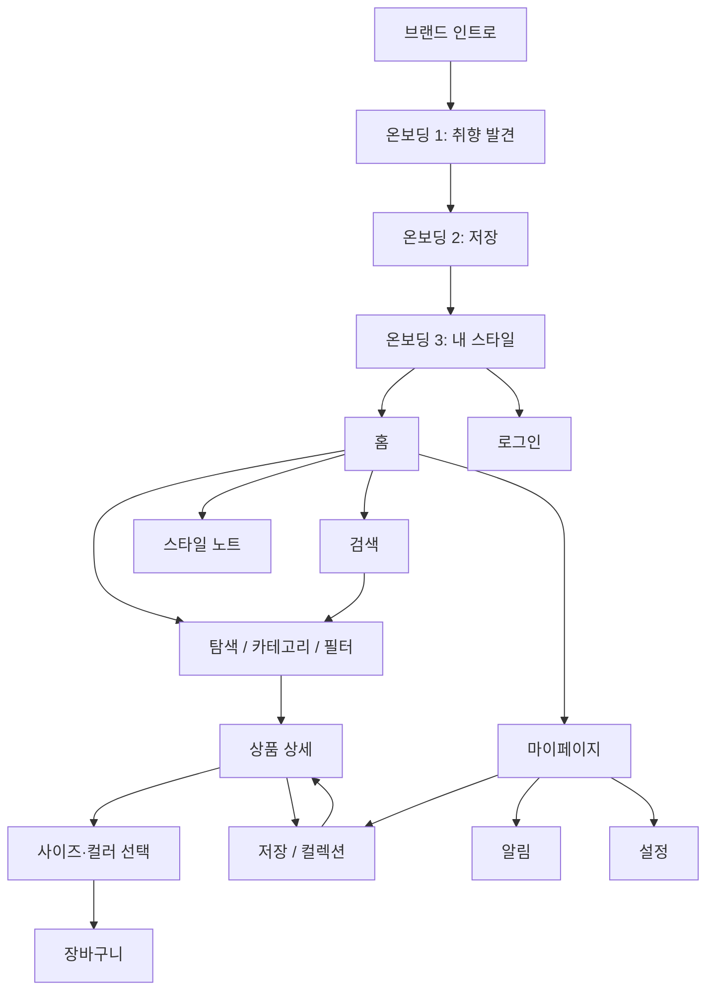

# AFTER CLASS — 디자인 원본 v1

2026-09-16 / 여성 10대 의류 / PC + 모바일웹 / 제작 단계 1

## 1. 콘셉트

**방과 후, 나를 입는 시간.** 정해진 시간표를 벗어나 취향을 발견하는 의류 쇼핑 브랜드. 핵심 사용자는 16–19세의 여성 고객이며, 핵심 행동은 **스타일 발견 → 상품 비교·선택 → 저장·장바구니 담기**다. 편안한 일상복과 감도 있는 편집을 결합한다. 가칭 브랜드, 상품명, 가격과 알림 내용은 디자인 시안용이다.

키워드: 자유 / 여백 / 일상 / 발견 / 선명함 / 편안함. 스타일: 미니멀 에디토리얼 + 소프트 캐주얼. 사용자 요청의 CROWNY식 여백·그리드·타이포 원칙을 유지하되, 금지한 그라데이션·유리 효과는 사용하지 않았다. Locomotive·Baillat의 특정 페이지를 복제하거나 직접 조사한 결과물은 아니다. 사용자가 제시한 타이포와 리듬의 방향을 독립적으로 해석했다.

PC는 넓은 캠페인 사진과 4열 상품 진열. 모바일은 2열 상품과 엄지 영역의 행동 버튼, 4개 하단 탭으로 다시 구성한다. 단순 축소가 아니다. 카드 배경의 반복 대신 여백·얇은 선·글자 크기로 구획한다.

## 2. 토큰

| 규칙 | 값 | 적용 |
|---|---|---|
| Ink | #20211F | 제목·본문·기본 버튼 |
| Cobalt | #2449E8 | 핵심 행동·새 콘텐츠·저장 |
| Paper | #F7F6F2 | 기본 배경 |
| Surface | #EEEEE8 | 제품 사진 바탕·로딩 |
| Muted | #686A65 | 보조 문장 |
| Line | #D8D9D2 | 구분선·폼 |
| Error | #B42D35 | 오류 문장 + 테두리 |
| Dark | #181A1A / #F0F0E9 / #91A8FF | 배경 / 글자 / 행동 |
| 한글 | Pretendard 400/600/700 | 본문·제품명·버튼 |
| 영문 | Archivo 400–900 | 로고·에디토리얼 제목 |
| 본문 | 14–16px, 행간 1.6–1.8 | 읽는 문장 |
| 제품명 | 모바일 12px / PC 14px | 짧은 1–2줄 라벨 |
| 히어로 | 모바일 65px / PC 104px | 큰 제목 |
| 제목 | 모바일 33–44px / PC 54–76px | 정보 위계 |
| 간격 | 4 / 8 / 12 / 16 / 24 / 32 / 44 / 80 | 작은 단위부터 섹션 간격까지 |
| 그리드 | 모바일 좌우 24px, 열간 12px / PC 좌우 5%, 열간 26px | 393px / 1440px 기준 |
| 모서리 | 사진 0 / 버튼 3 / 입력 0 / 시트 상단 14 | 역할별 차등 |
| 터치 | 기본 44×44px 이상 | 주요 아이콘·버튼 |
| 아이콘 | 24px viewBox, 1.5px 단색 선 | 직접 작성한 SVG 15종 |

웹폰트는 Pretendard 공식 배포 CDN과 Google Fonts를 사용한다. 이미지 원격 호출은 없다. 다음 배포 단계에서 라이선스 고지와 폰트 자체 호스팅을 확정한다.

## 3. 정보구조와 흐름

하단 메뉴는 홈·탐색·저장·마이 4개. 검색·알림·장바구니는 헤더에서 접근한다. 상세에서는 하단 메뉴를 구매 행동 바가 대체한다. 온보딩은 언제든 건너뛸 수 있다. 로그인 없이 탐색할 수 있다.

## 4. 화면 목록

`index.html?view=review`는 아래 23개 화면을 393×852 아트보드로 나란히 보여준다. 각 아트보드는 실제 스크롤과 클릭을 지원한다.

| 화면 | screen 값 | 중심 행동 |
|---|---|---|
| 홈 | home | 가을 컬렉션 보기 |
| 탐색 | list | 조건에 맞는 상품 찾기 |
| 상세 | detail | 사이즈 선택 후 담기 |
| 인트로 | intro | 브랜드 시작 |
| 온보딩 3장 | onboarding-1 / 2 / 3 | 발견·저장·내 스타일 이해 |
| 검색 전 | search | 검색어 입력 |
| 입력 중 | search-typing | 연관 상품 확인 |
| 검색 결과 | search-results | 니트 결과 비교 |
| 결과 없음 | search-none | 검색어 수정 |
| 저장 | saved | 컬렉션으로 다시 찾기 |
| 알림 | activity | 읽지 않은 소식 확인 |
| 마이 | my | 나의 기록 확인 |
| 설정 | settings | 알림·테마 선택 |
| 빈 화면 | empty | 새로운 취향 찾기 |
| 연결 오류 | error | 다시 시도 |
| 권한 안내 | permission | 알림 선택 |
| 스켈레톤 | loading | 결과의 구조 예고 |
| 완료 | success | 장바구니로 이동 |
| 장바구니 | cart | 담은 상품 확인 |
| 로그인 | login | 계정 진입 |
| 브랜드 콘텐츠 | editorial | 스타일 노트 읽기 |

## 5. 상태 설계

각 화면의 상태는 색상만으로 구분하지 않는다. 오류는 문장+테두리, 선택은 선+채움+aria-pressed, 알림은 ‘읽지 않음’ 문구, 로딩은 실제 콘텐츠 비율을 유지하는 스켈레톤이다. 화면별 상태 리뷰는 `index.html?view=states`에서 확인한다.

| 화면 | 로딩 | 비어 있음 | 오류 | 선택·완료 |
|---|---|---|---|---|
| 홈 | 캠페인 비율·상품 2열 유지 | 새 컬렉션 준비 안내 | 다시 연결 | 캠페인 행동 표시 |
| 탐색 | 상품 2열 스켈레톤 | 필터 조건 완화 안내 | 재시도 | 카테고리 밑줄·필터 채움 |
| 상세 | 이미지·상품명 자리 유지 | 판매 종료 안내 | 상품 재조회 | 사이즈 오류·색상선택·금액 변경·담기 완료 |
| 검색 | 결과 2열 유지 | 검색어 변경 권유 | 검색 재시도 | 입력 중 / 결과 / 검색어 지우기 |
| 저장 | 저장상품 2열 | 첫 저장 유도 | 옷장 재조회 | 저장 해제+되돌리기·컬렉션 생성 |
| 알림 | 날짜 그룹+행 스켈레톤 | 새 소식 없음 | 재시도 | 전체 읽음·미확인 텍스트 제거 |
| 마이 | 프로필·활동 행 유지 | 로그인 유도 | 기록 재조회 | 설정으로 이동 |
| 장바구니 | 상품행·합계 자리 유지 | 쇼핑 계속 | 다시 확인 | 주문 연결 전 안내 |
| 로그인 | 제출 버튼 진행 중 | 입력 대기 | 필수 입력 오류 | 계정 연결 전 안내 |

상태는 시각·인터랙션 확인용이다. 네트워크 실패나 실제 로그인·상품 판매 상태와 연동한 운영 코드가 아니다.

## 6. 모션과 터치

핵심 순간 네 곳에 집중한다.

1. 브랜드 인트로: 세 줄의 문장이 아래에서 800ms 동안 올라온다. 줄마다 120ms 차이. 일반 실행은 1.6초 뒤 온보딩으로 이어지며, 사용자는 화살표로 즉시 다음으로 갈 수 있다. 리뷰 아트보드에서는 비교를 위해 자동 이동하지 않는다.
2. 화면 이동: 지원 브라우저의 CSS View Transition 220ms. 목록에서 누른 상품 이미지와 상세 갤러리에 같은 전환 이름을 붙여 관계를 유지한다. 미지원 브라우저는 정상 페이지 전환. Safari/Android 실기기별 세부 전환은 개발 단계에서 검수한다.
3. 저장: 하트 채움 즉시 반영, 완료 토스트 4초. 해제에는 ‘되돌리기’. 선택은 localStorage로 유지.
4. 수량: 합계 금액을 240ms 위쪽 방향으로 등장. 1–99 범위. 로딩 반복은 저자극 명도 변화만 사용.

사용자 스크롤을 가로채지 않는다. 콘텐츠는 기본으로 보이고 진입 효과는 240ms 이하라 스크롤을 기다리게 하지 않는다. `prefers-reduced-motion: reduce`면 전환·인트로·스켈레톤 움직임을 끈다. 가로 추천은 다음 상품 일부 노출과 scroll-snap을 적용한다. 장식 커서·강제 패럴랙스·유리 효과는 없다.

모바일 safe-area는 상·하단 모두 대응한다. 검색창은 화면 상단, 시트의 입력과 확인은 가까이 배치한다. 입력 포커스 시 브라우저가 스크롤할 수 있다. 실제 iOS/Android 키보드와 화면 읽기 검수는 후속 기기 QA 대상이다. 다크 모드는 별도 중성 배경·명도·포인트색 및 이미지 밝기 82%/채도 85%로 조정한다.

## 7. 이미지와 상품 대응

이미지는 내장 ImageGen으로 새로 생성한 실사 스타일의 디자인용 자산이다. 실제 촬영물이나 실존 판매 상품 사진으로 주장하지 않는다. 인물은 성인 모델 설정이다. 생성 프롬프트는 `IMAGE-PROMPTS.md`.

| 파일 | 실제 크기 | 용도 |
|---|---|---|
| images/editorial.png | 1536×1024 | 캠페인·스타일 노트·온보딩 |
| images/products.png | 1254×1254 | 상품 4개를 같은 조명으로 구성한 2×2 시트 |

상품 시트 좌상: 데이오프 라운드 가디건 ₩32,000 / 우상: 소프트 케이블 니트 ₩39,000 / 좌하: 위켄드 와이드 데님 ₩42,000 / 우하: 플리츠 미디 스커트 ₩36,000. CSS 배경 위치로 개별 상품을 표시한다. 실제 카페24 상품 등록 때에는 개별 대표 이미지로 내보내고 실제 재고·가격·옵션과 연결해야 한다. 이미지 생성 관련 일반 인계 규칙보다 이번 사용자의 완성된 실사 시안 제작 지시를 우선했다.

## 8. 다음 단계 개발 인계

원본: index.html, design/app.js, design/style.css, images/. 현 단계는 디자인 검토용이므로 카페24 배포 가능한 스킨이 아니다. 데모 상품·저장·알림을 실제 데이터로 오해하지 않도록 실제 몰에 바로 올리지 않는다.

카페24 변환 시 헤더 분류는 Layout_category, 메인 진열은 product_listmain_N, 목록은 product_listnormal, 상세는 product_detail와 product_addimage, 후기는 product_review, 저장은 실제 위시리스트에 연결한다. 반복행·가격·후기·재고·회원별 상태를 실제 모듈로 교체한다. 메인 섹션 편집 표식 data-section을 유지하고 data-edit를 전체 편집 요소에 확장한다. 제품 이미지는 실제 판매 승인 자산으로 교체·분리한다.

한국어 디자인 원본만 포함한다. 한·영·중·일 운영 창구, 배송·약관·계정·결제·푸터 사업자정보, 실제 상품 옵션, 라이선스 검토와 등록은 후속 단계다. 이번 단계에서 외부 게시·로그인·파일 다운로드·결제·등록은 수행하지 않았다.
